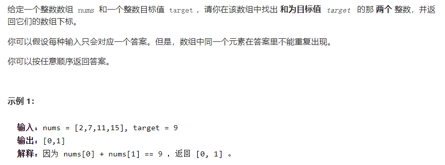
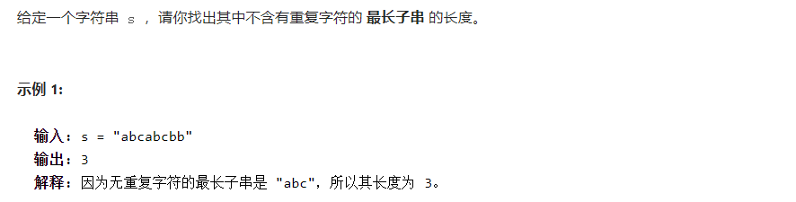
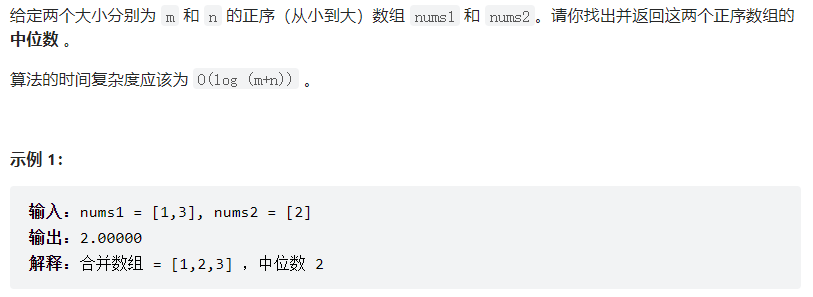

[TOC]

# 模拟：

### 1. 两数之和



思路：哈希表去重。

```c++
class Solution {
public:
    vector<int> twoSum(vector<int>& nums, int t) {
		unordered_map<int, int> mp;
		int sz = SZ(nums);
		rep(i, 0, sz-1) {
			int b = t - nums[i];
			auto it = mp.find(b);
			if (it != mp.end()) return {it->se, i};
			mp[nums[i]] = i;
		}
		return {};
    }
};
```

# 双指针：


# 滑动窗口：

### 3. 无重复字符的最长子串



思路：利用桶记录冲突字符index，避免遍历查找

```c++
class Solution {
public:
    int lengthOfLongestSubstring(string s) {
		int sz = SZ(s);
		if (!sz) return 0;
		vector<int> mp(128, -1);
		int mx = INT_MIN;
		int i = 0, j = 0;
		while (j < sz) {
			int idx = mp[s[j]];	
			if (idx >= i) {
				i = idx + 1;
			}
			mp[s[j]] = j;
			mx = max(mx, j - i + 1);
			++j;
		}
		return mx;
    }
};
```

# 二分：

### 4. 寻找两个正序数组的中位数



思路：利用二分寻找第K小的数，始终保持递归函数中nums1数组长度最长以避免不必要的边界情况讨论。

```c++
class Solution {
public:
    double findMedianSortedArrays(vector<int>& nums1, vector<int>& nums2) {
		int m = SZ(nums1), n = SZ(nums2);
		if ((m + n) & 1)
			return searchK(nums1, 0, nums2, 0, (m + n + 1) >> 1);
		else {
			int l = searchK(nums1, 0, nums2, 0, (m + n + 1) >> 1);
			int r = searchK(nums1, 0, nums2, 0, (m + n + 2) >> 1);
			return (l + r) / 2.0;
		}
		return -1;
    }
    
    int searchK(vector<int>& nums1, int s1, vector<int>& nums2, int s2, int k) {
    	int len1 = SZ(nums1) - s1;
    	int len2 = SZ(nums2) - s2;
    	
    	if (len1 < len2) return searchK(nums2, s2, nums1, s1, k);
		if (len2 == 0) return nums1[s1 + k - 1];
		if (k == 1) return min(nums2[s2], nums1[s1]);
    	
    	int i = s1 + min(len1, k >> 1) - 1;
    	int j = s2 + min(len2, k >> 1) - 1;
    	if (nums1[i] > nums2[j]) {
    		return searchK(nums1, s1, nums2, j+1, k - (j - s2 + 1));
		} else {
			return searchK(nums1, i+1, nums2, s2, k - (i - s1 + 1));
		}
	}
};
```

