[TOC]


**注意点一：考虑数据规模为0或1的情况**

# 模拟：

### 1. 两数之和【简单】


思路：哈希表去重。

```c++
class Solution {
public:
    vector<int> twoSum(vector<int>& nums, int t) {
		unordered_map<int, int> mp;
		int sz = SZ(nums);
		rep(i, 0, sz-1) {
			int b = t - nums[i];
			auto it = mp.find(b);
			if (it != mp.end()) return {it->se, i};
			mp[nums[i]] = i;
		}
		return {};
    }
};
```

### 2. 两数相加【中等】

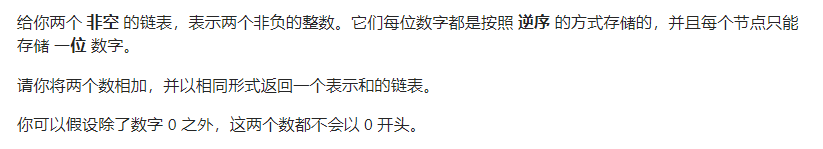

思路：虚拟头节点。

```c++
class Solution {
public:
    ListNode* addTwoNumbers(ListNode* h1, ListNode* h2) {
		ListNode* head = new ListNode();
		ListNode* p = head;
		int carry = 0;
		
		while (h1 != nullptr || h2 != nullptr) {
			int cur = 0;
			if (h1 != nullptr) cur += h1->val; 
			if (h2 != nullptr) cur += h2->val;
			cur += carry;
			carry = cur / 10;
			cur = cur % 10;
			p->next = new ListNode(cur);
			p = p->next;
			
			if (h1 != nullptr) h1 = h1->next;
			if (h2 != nullptr) h2 = h2->next; 
		}
		if (carry == 1) p->next = new ListNode(1);
		return head->next;
    }
};
```

### 6. Z 字形变换【中等】

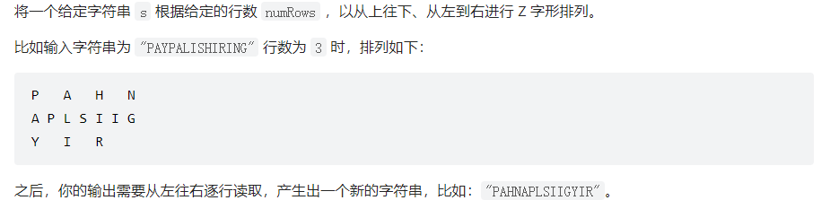

```c++
class Solution {
public:
    string convert(string s, int n) {
        if (n == 1 || n >= s.size()) return s;
        vector<string> v(n);
        int sz = SZ(s);
        int flag = 1;
        int i = 0;
        rep(k, 0, sz - 1) {
            v[i] += s[k];
            i += flag;
            if (i == n - 1 || i == 0) flag = -flag;
        }
        string res;
        for (auto& str: v) res += str;
        return res;
    }
};
```

### 7. 整数反转【中等】

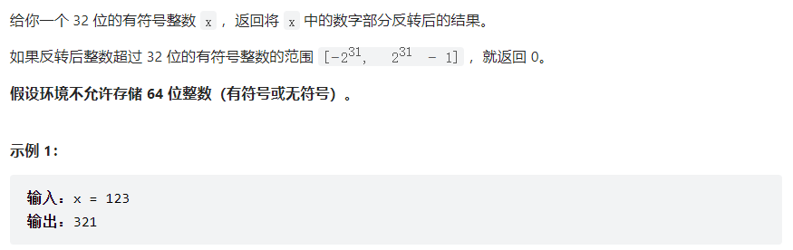

思路：提前判断下一个`res`是否超过表示范围即`res > INT_MAX / 10 || res < INT_MIN / 10`。

```c++
class Solution {
public:
    int reverse(int x) {
        int res = 0;
        while (x != 0) {
            int tmp = x % 10;
            if (res > INT_MAX / 10 || res < INT_MIN / 10) return 0;
            res = res * 10 + tmp;
            x /= 10;
        }
        return res;
    }
};
```

### 8. 字符串转换整数 (atoi)【中等】

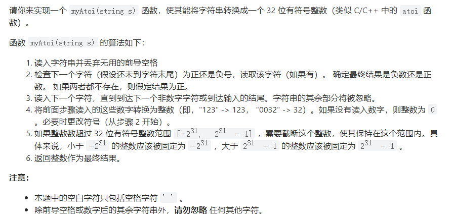

思路：**一步一步遵循所给算法，不要想当然！**

```c++
class Solution {
public:
    int myAtoi(string s) {
        int sz = SZ(s);
        int res = 0;
        int index = 0;
        int sign = 1;
        while (s[index] == ' ' && index < sz) index++;
        if (index == sz) return 0;

        if (s[index] == '+') {
            ++index;
        } else if (s[index] == '-') {
            sign = -sign;
            ++index;
        }

        res = res * sign;
        while (index < sz) {
            if (s[index] < '0' || s[index] > '9') break;
            else if (res > INT_MAX / 10 || res < INT_MIN / 10) return sign == 1 ? INT_MAX : INT_MIN;
            else if (res == INT_MAX / 10 || res == INT_MIN / 10) {
                if (sign == 1 && (s[index] - '0') > 7) return INT_MAX;
                if (sign == -1 && (s[index] - '0') > 8) return INT_MIN;
            }
            res = res * 10 + (s[index] - '0') * sign;
            ++index;
        }
        return res;
    }
};
```

### 9. 回文数【简单】

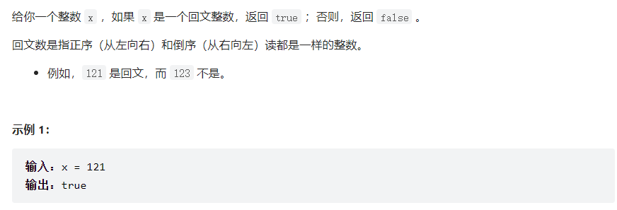

```c++
class Solution {
public:
    bool isPalindrome(int x) {
        if (x < 0) return false;
        int xx = x;
        int res = 0;
        while (xx != 0) {
            int tmp = xx % 10;
            if (res > INT_MAX / 10) return false;
            res = res * 10 + tmp;
            xx /= 10;
        }
        return res == x;
    }
};
```

# 双指针：

### 15. 三数之和【中等】

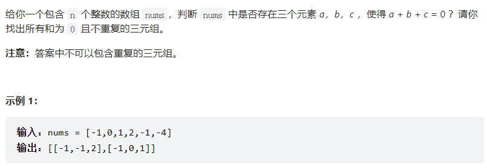

思路：先排序，使用三个指针 `i`、`j` 和 `k` 分别代表要找的三个数，枚举`i`，令`j=i+1`，`k=n-1`，`sum=nums[i]+nums[j]+nums[k]`，移动`j`、`k`使得`sum==0`。**注意`sum==0`时的去重操作**。

```c++
class Solution {
public:
    vector<vector<int>> threeSum(vector<int>& nums) {
		vector<vector<int>> res;
		sort(nums.begin(), nums.end());
		int sz = SZ(nums);
		rep(i, 0, sz-1) {
			while (i > 0 && i < sz && nums[i] == nums[i-1]) ++i;
			int j = i + 1, k = sz - 1;
			while (j < k) {
				int sum = nums[i] + nums[j] + nums[k];
				if (sum == 0) {
					res.pb({nums[i], nums[j], nums[k]});
					++j;
					--k;
					while (j < k && nums[j] == nums[j-1]) ++j;
					while (j < k && nums[k] == nums[k+1]) --k; 
				} else if (sum < 0) {
					++j;
				} else {
					--k;
				}
			}
		}
		return res;
    }
};
```

# 滑动窗口：

### 3. 无重复字符的最长子串【中等】


思路：利用桶记录冲突字符`index`，避免遍历查找。

```c++
class Solution {
public:
    int lengthOfLongestSubstring(string s) {
		int sz = SZ(s);
		if (!sz) return 0;
		vector<int> mp(128, -1);
		int mx = INT_MIN;
		int i = 0, j = 0;
		while (j < sz) {
			int idx = mp[s[j]];	
			if (idx >= i) {
				i = idx + 1;
			}
			mp[s[j]] = j;
			mx = max(mx, j - i + 1);
			++j;
		}
		return mx;
    }
};
```

# 二分：

### 4. 寻找两个正序数组的中位数【困难】


思路：利用二分寻找第`K`小的数，始终保持递归函数中`nums1`数组长度最长以避免不必要的边界情况讨论。

```c++
class Solution {
public:
    double findMedianSortedArrays(vector<int>& nums1, vector<int>& nums2) {
		int m = SZ(nums1), n = SZ(nums2);
		if ((m + n) & 1)
			return searchK(nums1, 0, nums2, 0, (m + n + 1) >> 1);
		else {
			int l = searchK(nums1, 0, nums2, 0, (m + n + 1) >> 1);
			int r = searchK(nums1, 0, nums2, 0, (m + n + 2) >> 1);
			return (l + r) / 2.0;
		}
		return -1;
    }
    
    int searchK(vector<int>& nums1, int s1, vector<int>& nums2, int s2, int k) {
    	int len1 = SZ(nums1) - s1;
    	int len2 = SZ(nums2) - s2;
    	
    	if (len1 < len2) return searchK(nums2, s2, nums1, s1, k);
		if (len2 == 0) return nums1[s1 + k - 1];
		if (k == 1) return min(nums2[s2], nums1[s1]);
    	
    	int i = s1 + min(len1, k >> 1) - 1;
    	int j = s2 + min(len2, k >> 1) - 1;
    	if (nums1[i] > nums2[j]) {
    		return searchK(nums1, s1, nums2, j+1, k - (j - s2 + 1));
		} else {
			return searchK(nums1, i+1, nums2, s2, k - (i - s1 + 1));
		}
	}
};
```

# 贪心：

### 11. 盛最多水的容器【中等】

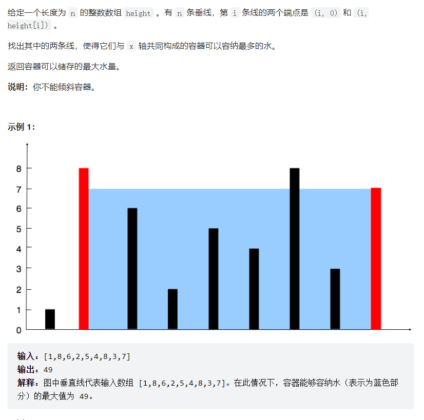

思路：双指针+贪心，$S(i,j)=min(h[i], h[j])\times(j-i)$

```c++
class Solution {
public:
    int maxArea(vector<int>& h) {
		int sz = SZ(h);
		int mx = INT_MIN;
		int i = 0, j = sz - 1;
		while (i < j) {
			mx = max(mx, (i - j) * min(h[i], h[j]));
			if (h[i] < h[j]) i++;
			else j--;
		}
		return mx;
    }
};
```

# 树的搜索：

### 74. 搜索二维矩阵【中等】

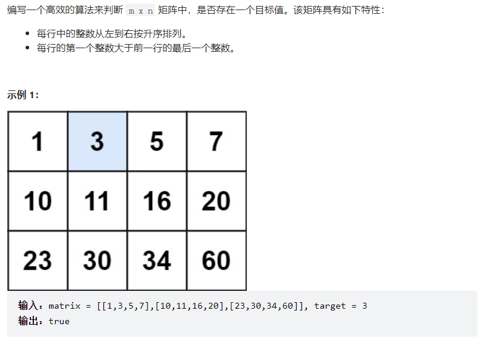

思路：（1）以右上角元素作为二叉搜索树的根。（2）二分查找。

```c++
class Solution {
public:
    bool searchMatrix(vector<vector<int>>& mt, int tgt) {
		int m = SZ(mt), n = SZ(mt[0]);
		int x = 0, y = n - 1;
		auto chk = [m, n](int i, int j) {
			return i >= 0 && i < m && j >= 0 && j < n;
		};
		while (chk(x, y)) {
			if (mt[x][y] < tgt) ++x;
			else if (mt[x][y] > tgt) --y;
			else return true;
		}
		return false;
    }
};
```

### 45. 跳跃游戏 II【中等】

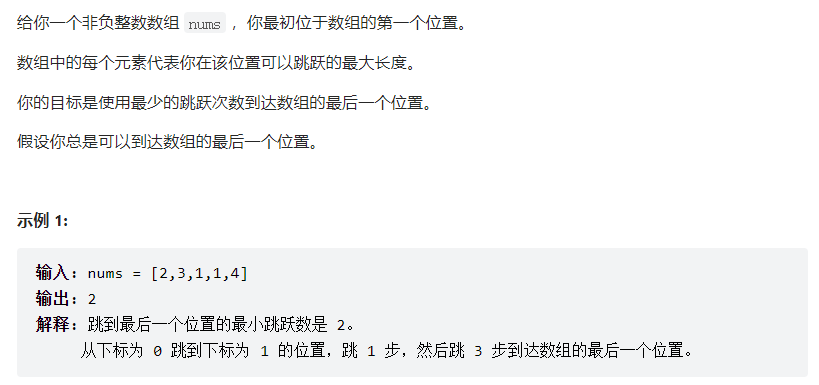

```c++
class Solution {
public:
    int jump(vector<int>& nums) {
        int maxPos = 0, n = nums.size(), end = 0, step = 0;
        for (int i = 0; i < n - 1; ++i) {
            maxPos = max(maxPos, i + nums[i]);
            if (i == end) {
                end = maxPos;	
                ++step;
            }
        }
        return step;
    }
};
```

# 回溯：

### 17. 电话号码的字母组合【中等】

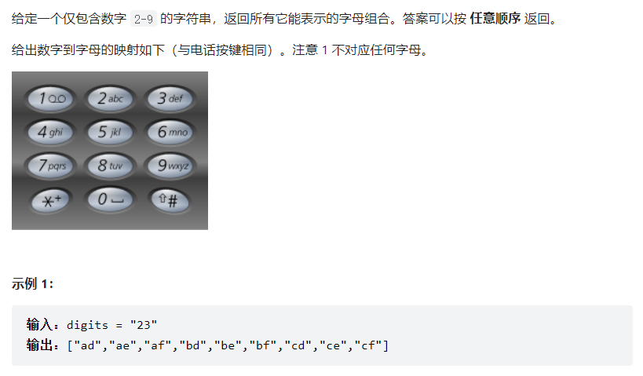

```c++
class Solution {
public:
    vector<string> res;
    vector<string> mp{"abc", "def", "ghi", "jkl", "mno", "pqrs", "tuv", "wxyz"};
    string t;
    vector<string> letterCombinations(string digits) {
		if (SZ(digits) == 0) return {};
		backtrack(digits, 0);
		return res; 
    }
    
    void backtrack(string& ds, int cur) {
    	if (cur == SZ(ds)) {res.pb(t); return ;}
		for (auto c: mp[ds[cur] - '2']) {
            t.pb(c);
            backtrack(ds, cur+1);
            t.pop_back();
        }
	}
};
```

### 78. 子集【中等】

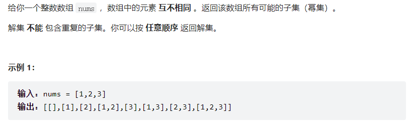

```c++
class Solution {
public:
	vector<int> t;
    vector<vector<int>> res;
	vector<vector<int>> subsets(vector<int>& nums) {
		backtrack(0, nums);
		return res;
    }
    
    void backtrack(int cur, vector<int>& nums) {
    	if (cur == SZ(nums)) {res.pb(t); return ;}
		t.pb(nums[cur]);
		backtrack(cur+1, nums); 
		t.pop_back();
		backtrack(cur+1, nums);
	}
};
```

### 90. 子集 II【中等】

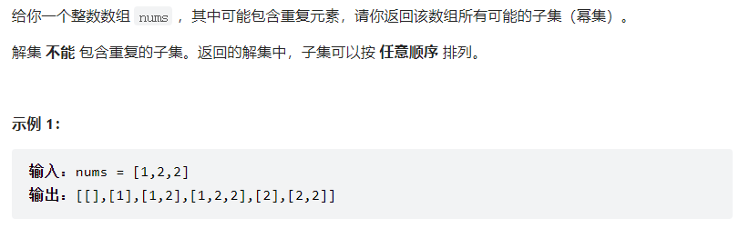

思路：去重方法（1）剪枝（2）Set

```c++
class Solution {
public:
	vector<int> t;
    vector<vector<int>> res;
	vector<vector<int>> subsetsWithDup(vector<int>& nums) {
		sort(nums.begin(), nums.end());
		backtrack(false, 0, nums);
		return res;
    }
    
    void backtrack(bool chosen, int cur, vector<int>& nums) {
    	if (cur == SZ(nums)) {res.pb(t); return ;}
    	t.pb(nums[cur]);
    	backtrack(true, cur+1, nums); 
    	t.pop_back();
    	if (chosen && nums[cur] == nums[cur - 1]) {
			return ;
		} else {
			backtrack(false, cur+1, nums);
		}
	}
};
```

# BFS：

### 297. 二叉树的序列化与反序列化【困难】

```c++
class Codec {
public:
	string serialize(TreeNode* root) {
        string res;
        queue<TreeNode*> q;
        q.push(root);
        TreeNode* cur;
        while (!q.empty()) {
        	cur = q.front(); q.pop();
        	if (cur == nullptr) {
        		res += "#,";
			} else {
				res += to_string(cur->val) + ',';
				q.push(cur->left);
				q.push(cur->right);
			}
		}
		return res;
    }
	
	TreeNode* deserialize(string data) {        
        vector<string> v;
        string tmp;
        for (auto c: data) {
        	if (c == ',') {
        		v.pb(tmp);
				tmp.clear(); 
			} else {
				tmp += c;
			}
		}
        if (v[0] == "#") return nullptr;
        
        queue<TreeNode*> q;
        int i = 0;
		TreeNode* root = new TreeNode(stoi(v[i++]));
		q.push(root);
        TreeNode* cur;
		while (!q.empty()) {
			cur = q.front(); q.pop();
			if (v[i] != "#") {
				cur->left = new TreeNode(stoi(v[i]));
				q.push(cur->left);
			} else {
				cur->left = nullptr;
			}
			++i;
			if (v[i] != "#") {
				cur->right = new TreeNode(stoi(v[i]));
				q.push(cur->right);
			} else {
				cur->right = nullptr;
			}
			++i;
		}
		return root;
    }
};
```

# DFS：

### 1239. 串联字符串的最大长度【中等】

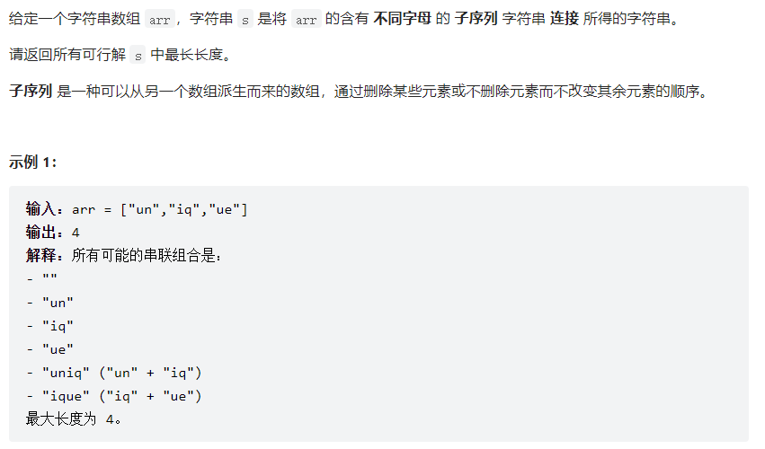

思路：`__builtin_popcount`函数。

```c++
class Solution {
public:
    int mx = 0;
    int maxLength(vector<string>& arr) {
        int sz_arr = SZ(arr);
        vector<int> f;
        rep(i, 0, sz_arr - 1) {
            string tmp = arr[i];
            int mask = 0;
            int sz_str = SZ(tmp);
            bool ok = true;
            rep(j, 0, sz_str - 1) {
                if (mask & (1 << (tmp[j] - 'a'))) {
                    ok = !ok;
                    break;
                } else {
                    mask |= 1 << (tmp[j] - 'a');
                }
            }
            if (ok) f.pb(mask);
        }
        dfs(f, 0, 0);
        return mx;
    }

    void dfs(vector<int>& f, int idx, int up) {
        if (idx == f.size()) {
            mx = max(__builtin_popcount(up), mx);
            return;
        }

        int cur = f[idx];
        if (cur & up) {
            mx = max(__builtin_popcount(up), mx);
        } else {
            dfs(f, idx+1, up | cur);
        }
        dfs(f, idx+1, up);
    }
};
```

# 二进制枚举：

### 2212. 射箭比赛中的最大得分【中等】

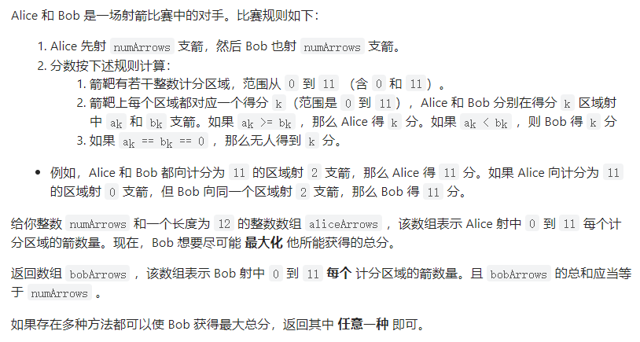

```c++
class Solution {
public:
    vector<int> maximumBobPoints(int n, vector<int>& a) {
		int k = 12;
		int mx = 0;
		vector<int> res;
		rep(i, 0, (1 << k) - 1) {
        	int score = 0;
        	int cur_sum = 0;
			vector<int> tmp(k);
        	
        	rep(j, 0, k-1) {
        		if ((i >> j) & 1) {
        			cur_sum += a[j] + 1;
        			score += j;
        			tmp[j] = a[j] + 1;
				}
			}
        	
        	if (cur_sum > n) continue;
        	
        	if (score > mx) {
        		tmp[0] += n - cur_sum;
        		res = tmp;
        		mx = score;
			}
		}
		return res;
    }
};
```

# 动态规划：

### 5. 最长回文子串【中等】

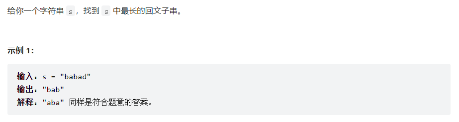

思路：（1）`dp[i][j] = s[i] == s[j] && (i + 1 == j || dp[i+1][j-1])`（2）斜序遍历

```c++
class Solution {
public:
    string longestPalindrome(string s) {
        int sz = SZ(s);
        vector<vector<bool>> dp(sz, vector<bool>(sz));
        rep(i, 0, sz - 1) dp[i][i] = true;

        int mx = 1, start = 0;
        rep(l, 2, sz) {
            rep(i, 0, sz-l) {
                int j = l + i - 1;
                dp[i][j] = s[i] == s[j] && (i + 1 == j || dp[i+1][j-1]);
                if (dp[i][j] && j - i + 1 > mx) {
                    mx = j - i + 1;
                    start = i;
                }
            }
        }
        return s.substr(start, mx);
    }
};
```

